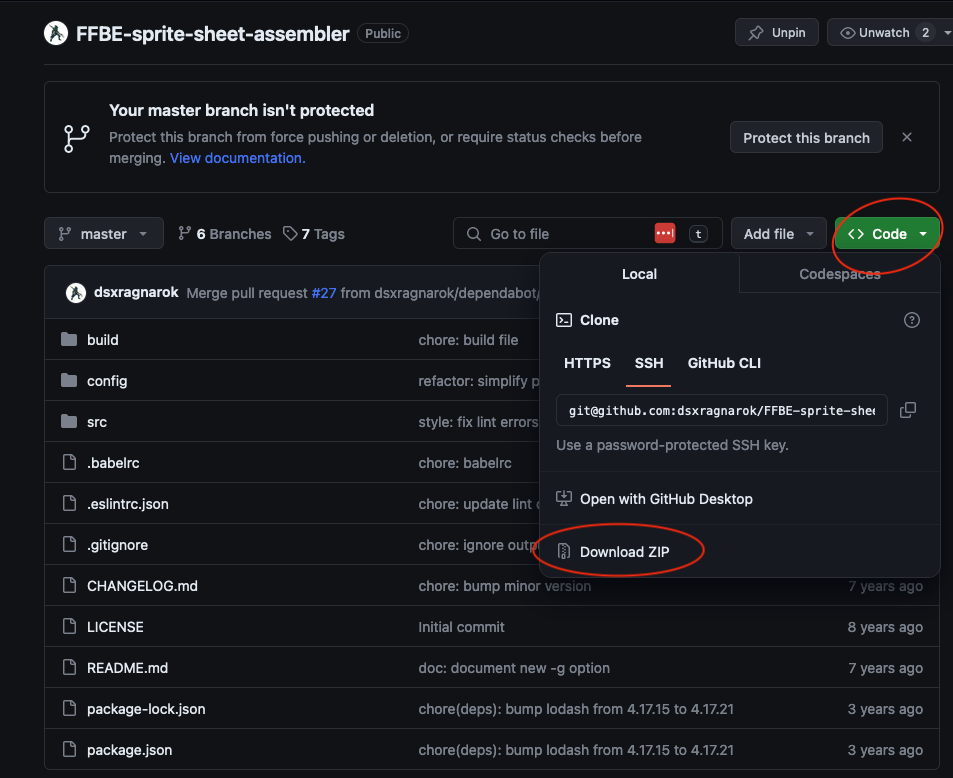

# Detailed Instructions
## Installation
### Requirements
Nodejs

1. Download the repository either with clone or the zip

2. Change to project's directory
    ```bash
    > cd FFBE-sprite-sheet-assembler
    ```

3. Install and build executable with npm. This builds the `ffbetool` executable in the project's `dist` directory. There will be one for each platform (MacOs, Windows and Linux). Use the one for your platform.

    ```bash
    > npm install && npm run build
    ```
## Usage
```
dist/ffbetool-macos num [-a anim] [-c columns] [-e] [-v] [-j] [-g] [-i inDir] [-o outDir]

```
* **num:** (required) the unit ID number, must be the first argument.
* **-a:** The animation name (ie. atk, idle, dead, win, etc.).
* **-c:** The number of columns in the sheet, if not specified the output will be a single-row strip.
* **-e:** If this option is included, the strips will include any empty frames. By default empty frames are excluded.
* **-v:** If this option is included, more information will be printed to console.
* **-j:** This option saves the sheet information in json format saved as a .json file.
* **-g:** If htis option is included, an animated gif will also be outputed.
* **-i:** The input path, defaults to current directory.
* **-o:** The output path, defaults to current directory.

### Step-by-Step Example
1. You will need an **input directory** and **output directory**.

    The input directory will need the following files:

    - The master atlas sheet. Its filename looks like the following: ***unit_anime_204000103.png***
    - The master metadata file. Its filename looks like the following: ***unit_cgg_204000103.csv***
    - The csv file for the animation you want (example **limit_atk**). Its filename will look like the following: ***unit_limit_atk_cgs_204000103.csv***
2. To assemble a spritesheet, run the following command passing in the input and output directories to the `-i` and `-o` flags respectively. This will assemble all the animations in the input directory.

    ```bash
    > dist/ffbetool-macos 204000103 -i ./build/tmp/kain-highwind -o ./output
    ```

3. Alternatively, use the `-a` flag to specify just one animation.

    ```bash
    > dist/ffbetool-macos 204000103 -a limit_atk -i ./build/tmp/kain-highwind -o ./output
    ```

### Note

If the input and/or output directory names have spaces then they will need to be escaped with backslash. Alternatively, enclosing the directories in quotes should also work.
```bash
> dist/ffbetool-macos 204000103 -i /Users/Kevin\ Phung/tmp/FFBE/input/Kain\ Highwind -o /Users/Kevin\ Phung/FFBE/output/Kain\ Highwind

> dist/ffbetool-macos 204000103 -i "/Users/Kevin Phung/tmp/FFBE/input/Kain Highwind" -o "/Users/Kevin Phung/FFBE/output/Kain Highwind"
```
